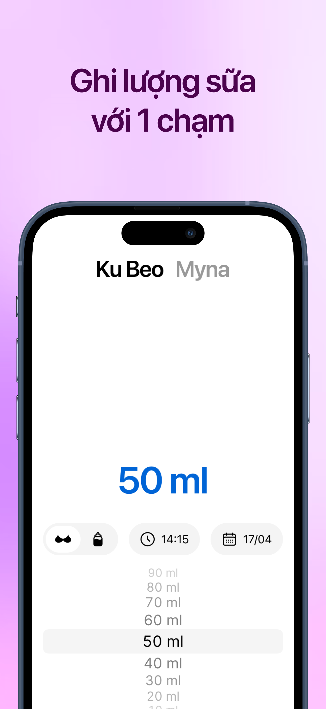
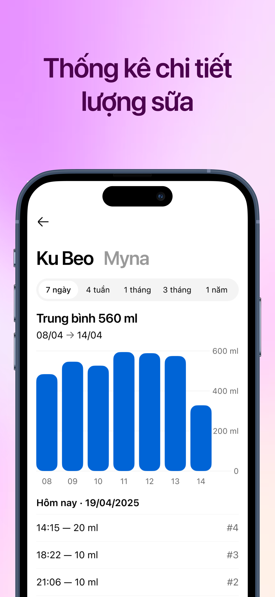

# BabySteps

  
  
  

BabySteps is a simple and efficient tool designed for parents and caregivers who want to track their baby's milk feeding schedule and monitor their nutrition intake. Whether you're a new parent or an experienced caregiver, BabySteps helps you maintain accurate feeding records and track your baby's daily milk consumption easily and quickly.

KEY FEATURES:
- Multi-Baby Support: Track multiple babies with individual profiles, names, and birth dates.
- Milk Feeding Tracking: Record breast milk and formula feedings with precise quantities (10ml to 400ml increments).
- Smart Quantity Management: Set default milk quantities or automatically use the last entered amount for convenience.
- Comprehensive Dashboard: View detailed feeding statistics with interactive charts showing daily, weekly, monthly, and 3-month trends.
- Family Sharing: Share baby profiles with family members using CloudKit for real-time collaboration across devices.
- Flexible Time Tracking: Record feedings with custom date and time stamps, perfect for tracking irregular feeding schedules.
- Beautiful Visualizations: Interactive bar charts showing daily milk intake with period-based filtering (7 days, 4 weeks, 1 month, 3 months).
- Theme Customization: Choose between light, dark, or automatic theme that follows your device settings.
- Offline Support: Works entirely offline for privacy and convenience, with CloudKit sync when connected.
- Made for Parents Who Prefer Simplicity Over Complexity: Fast, accurate, and easy to use without overwhelming features.

Ideal for new parents, caregivers, pediatricians, and anyone who needs to monitor infant nutrition and feeding patterns.

You can review our privacy policy and terms of use here:
- [Privacy Policy](./privacy-policy.md)
- [Terms of Use](./terms.md)
The most up-to-date versions of these documents are always available on our GitHub repository.

For questions or problems, please contact us by email: kenlaam.dev@gmail.com
